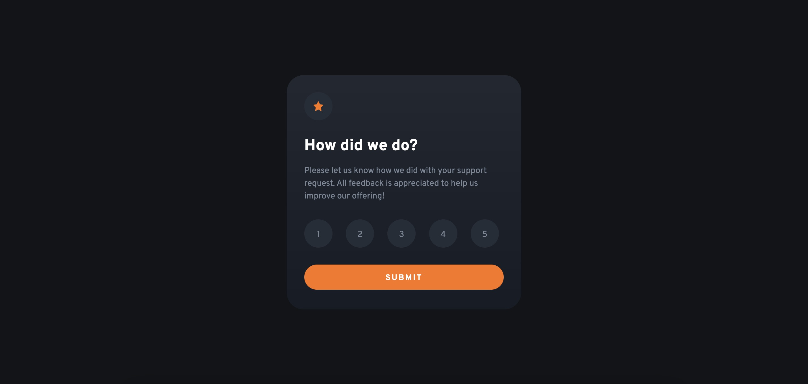
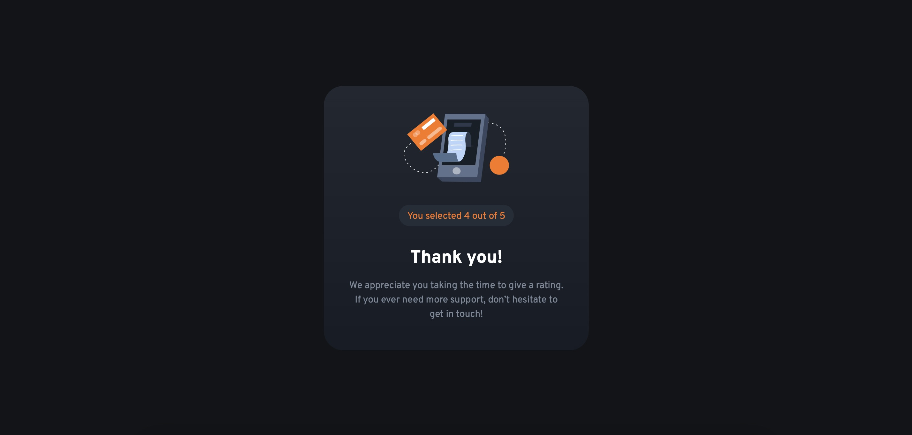

# Frontend Mentor - Interactive rating component solution

This is a solution to the [Interactive rating component challenge on Frontend Mentor](https://www.frontendmentor.io/challenges/interactive-rating-component-koxpeBUmI). Frontend Mentor challenges help you improve your coding skills by building realistic projects. 

## Table of contents

- [Overview](#overview)
  - [The challenge](#the-challenge)
  - [Screenshot](#screenshot)
  - [Links](#links)
- [My process](#my-process)
  - [Built with](#built-with)
  - [What I learned](#what-i-learned)
  - [Continued development](#continued-development)
  - [Useful resources](#useful-resources)
- [Author](#author)

## Overview

### The challenge

Users should be able to:

- View the optimal layout for the app depending on their device's screen size
- See hover states for all interactive elements on the page
- Select and submit a number rating
- See the "Thank you" card state after submitting a rating

### Screenshot




### Links

- Solution URL: [Solution URL]()
- Live Site URL: [Live site URL]()

## My process

### Built with

- Bootstrap 5
- Sass
- jQuery
- BEM methodology 

### What I learned

I'm so, so happy!!! It's the first time I've built a project on my own using Bootstrap, Sass and even some jQuery! I'm so proud of the result! I've been learning how to use this framework, this css preprocessor and this library for a few days and after coding a great project following a tutorial, I really wanted to try something without any help! I felt a bit lost at some point but to be honest, I haven't struggled that much!

While building this project, I learned more about bootstrap’s grid system, its containers and rows and its different breakpoints. I tried to use as much as I could bootstrap’s variables and its premade classes. I still needed from time to time to customize them, especially when trying to reproduce as close as possible the given design. I also tried to create a few Sass mixins, they are so convenient! I still have a lot to learn about them though!

Finally, the thing I'm the most thrilled about is the jQuery part. I think... I fell in love with this library! I find it so straightforward and pleasant to use! Even if I'm still a beginner with JavaScript, I find it really understandable and I love so much working with it. I can't wait to use it in bigger projects!

```javascript
$(document).ready(function() {

    let num = "";

    $(".box__rate-btn").click(function() {
        $(".box__rate-btn").removeClass("active");
        $(this).addClass("active");
        num = $(this).text();
    });

    $(".box__btn").click(function() {
        $(".box__rating-message").text("You selected " + num + " out of 5");
        $(".attribution").show(500);
        $(".state1").hide();
        $(".state2").show();
    });

});
```

### Continued development

For the first time, I tried to use BEM (Block Element Modifier) methodology. I've always been struggling to find efficient classes’ names so when I heard about this methodology, I was really eager to use it asap. So... I tried in this project! I think I made some mistakes because I'm still unsure how to use it properly. I definitely have to keep working on that but I like it!

I also absolutely want to learn more about JavaScript and jQuery. I've completed the JavaScript FreeCodeCamp course but even if I really enjoyed it, I found it lacking of concret exercices. I mean, I learned a lot about this language but not at all how to use it in a website creation context!!! Therefore, I undoubtedly need to practice by building projects as I know most of its concepts but not at all how to use them! 

### Useful resources

- [Bootstrap documentation](https://getbootstrap.com/docs/5.3/getting-started/introduction/) - 
- [BEM documentation](https://getbem.com/naming/) - 

## Author

- Frontend Mentor - [@Leo-Code-CA](https://www.frontendmentor.io/profile/Leo-Code-CA)
- FreeCodeCamp - [@Leo-code](https://www.freecodecamp.org/Leo-code)

